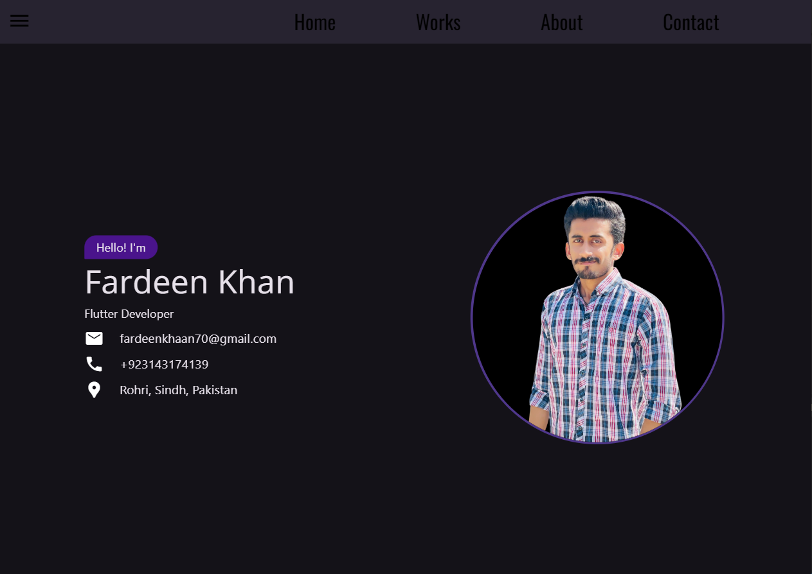

# Personal Portfolio

# For Web Screen

  

# For Mobile Screen

  

  

Welcome to my personal portfolio! 🚀 This project is a showcase of my work, skills, and dedication as a developer. It's designed to provide visitors with insights into my achievements, and the projects I've worked on, and a way to connect with me.

## 🌟 About This Portfolio

This portfolio is built using **Flutter** to ensure a beautiful and responsive UI across all devices. It demonstrates my passion for clean design, structured code, and an eye for detail. Each section is carefully crafted to give you a seamless experience while exploring my work.

### 🔍 Features
- **Interactive UI**: A smooth and engaging user interface showcasing my projects and skills.
- **Project Highlights**: Dive into details about my projects, complete with descriptions and visual previews.
- **Contact Section**: Connect with me easily through direct links to my socials.
- **Responsive Design**: Optimized for mobile, web, and desktop platforms.

## 🚀 Technologies Used
- **Frontend**: Flutter (Dart)
- **Backend**: Firebase (for backend services in select projects)
- **Hosting**: Deployed using Firebase Hosting

## 📞 Contact Me
Looking to collaborate or hire me? Let’s connect:
- **Email**: [fardeenkhaan70@gmail.com]
- **LinkedIn**: [https://linkedin.com/in/fardeenkhan51]
- **Twitter**: [https://x.com/KhaanFardeen1]

## ✨ How to View My Portfolio
The portfolio is live and can be accessed [here](https://fk-portfolio.web.app).

